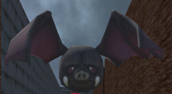
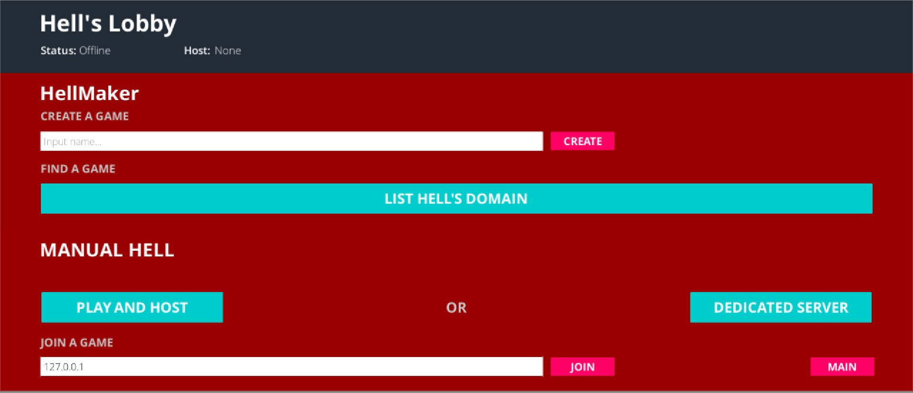

# TheDevilsChance
Contributors to this project: 
1. CHENG KUAN YONG, JASON
2. TAN ZHEN YE, BRYAN

## About the game
The project is a game in which the player has a choice of single player or multiplayer play. For single player, the player moves using the “w,a,s,d” and “space” key around the map to avoid monsters which will kill them and attempt to reach the end without dying. There are 3 levels and the way to access the next level is to collect 3 gems on each level and find the exit. This will bring the player to the next level. High scores based on time and number of deaths are then recorded.

For the multiplayer portion, it can be played either through the same WI-FI router, Local Area Network (LAN) gaming, or through the internet via unity’s multiplayer server. The goal of the multiplayer is slightly different as the goal is the first to collect 3 gems and there is only 1 level. In multiplayer, the number of gems scattered on the level is increased thus creating a fairer play and giving all players and equal chance to win. Up to 4 players can be connected at once.

## Objective
The objective of the entire project is to create a fun and simple game to play for both multiplayer and single player. This is achieved by having a simple goal of avoiding enemies, collecting 9 gems and getting to the exit in the fastest time for single player and avoiding enemies, collecting 3 gems and getting to the exit faster than the other players for multiplayer. Controls for both are also made simple and intuitive. ‘W,A,S,D’ for movement, ‘spacebar’ to jump and arrow keys for camera adjustment if needed. The details of which are in the game design section.

## Game Design
 

 
 

The project made use of the following principles to appeal to the player. Focal point, anticipation, announcement of change, physics, sound, and challenge. For the focal point, it is basically the goal. Which is to collect all 9 gems without dying. Anticipation comes in when the player has played the game for a while and is anticipating where the enemy is coming from. Announcement of change comes in when the player has collected 3 gems for each level. By playing the sound of the door opening, the player would know that something somewhere has happened even if the player cannot actually see it. Realistic physics means that when the player stands below the moving platform on level 2, the player will get squished and die. Having a soundtrack allowed us to add to the mood of the game since it is in hell, most of the music is quite ominous. Lastly would be challenge. Despite the relatively simple storyline and goal, there is an element of challenge as there is a highscore board at the end of the game.

### Voice-over Narrations

 

There are voice over in the game to relay the story in a more immersive way to the player.

### Level Design
#### Level 1 Design:

 

Each level is uniquely different from the other levels. In level 1, the monsters are slower than other levels and there are not many surprises. The challenge here is just the fact that the level is a maze. The idea behind this is to allow the player time to get used to the movement and camera movement before moving on to the next level. 

#### Level 2 Design:

In level 2, things start getting a bit more challenging as this is a conventional platformer level. However, to make things easier, should the player fall, they will not die as there is a moving platform to bring them back up. In this level, is also where the surprises start. One of the platforms is a disappearing platform. Should the player step on it, it will disappear and the player will fall to the ground. The level has been designed in such a way that the player will most likely step on the platform due to this being part of the shortest route to the exit. 

#### Level 3 Design:

Moving on to the last level, level 3 (Figure 10), the level is straight forward. There are no mazes, or disappearing platforms. Instead, the challenge in this level is how fast the enemies move. The player could attempt to read and memorize the enemies movements, since they move too fast to dodge, or just try their luck.

## Game Features

### Highscore Ranking

The game allows you to save your high score at the end of the game, and displays them at the title screen. The program saves the time taken to complete the game, puts them in an array with the rest of the non-null values of top 10 values and sorts them in ascending order, such that the fastest player to complete the game will be at the first rank. 

These scores are saved by using the Unity scripting API “PlayerPrefs”, and code is used to save these variables, sorts them in order, and outputs them to the screen. There is also an option of resetting the highscore saved with an UI button in the title screen.

### Audio
The game has many audio files playing such as the background music for each scene, as well as sound effects for dying, collecting gems and door opening. These audios are all controlled via script, which creates an instance of Audio Source unity game component to play the sound file, looping endlessly for background music, and playing once before destroying the Audio Source instance for sound effects. 

A sound manager plugin was used to simplify most of the Audio Source manipulation, providing many useful APIs for us to control the audio of the game. 

We created some UI sliders to control the Global music volume and Global sound effects volume to allow more flexibility in the game. These settings can be accessed in the title screen via an UI button, and can be brought up in the actual gameplay using the “Esc” button (refer to Appendix C).

## Multiplayer

Players can opt to play using Unity’s own servers, or host a local game where other players connect using the host’s IP address. A graphical user interface is designed and used as a network lobby room, where each networked game running on unity’s servers can be found and connected to, as well as hosting a custom game for other players to connect. This is to allow a more intuitive way for end users to access multiplayer mode, and also ensure that each player only spawns when all the players are connected.

Within the multiplayer game, players will be able to see each other’s name displayed above their avatars, and every event will be updated to all players in real time. The aim of the multiplayer game is to be the first to gather 3 diamonds, open the door and jump down, upon the screen will pause for every player, with text displaying the name of the player that won.

The multiplayer capability is made with the Unity Network Components provided in the unity editor. The Level 1 map is used as the map for the multiplayer mode as it is the largest map of the 3 levels, and it has a starting platform for multiple players to spawn into. The network start position game component is used to designated spawning points for players to spawn into so they don’t spawn in the same spot. Each networked object is given a network identity, and moving objects will also be assigned a network transform component to synchronise the movement and rotation of all networked objects among players. 

Variables or events that need to be synchronised among players, such as collection of diamonds or death of a player, are synchronised by declaring the variables as a Syncvar, as well as through server commands, designated by “[Command]” prefix. Once the condition is met, such as a player colliding with the gem object in game, a command is issued to the server to change the syncvar, usually a boolean flag, which then automatically changes the same variable in all the clients through RPC calls, thus synchronising each event. 

